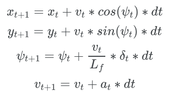
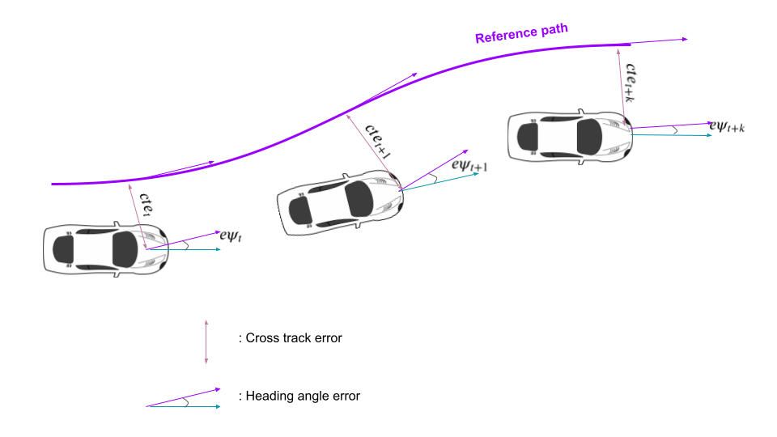
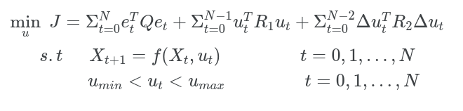
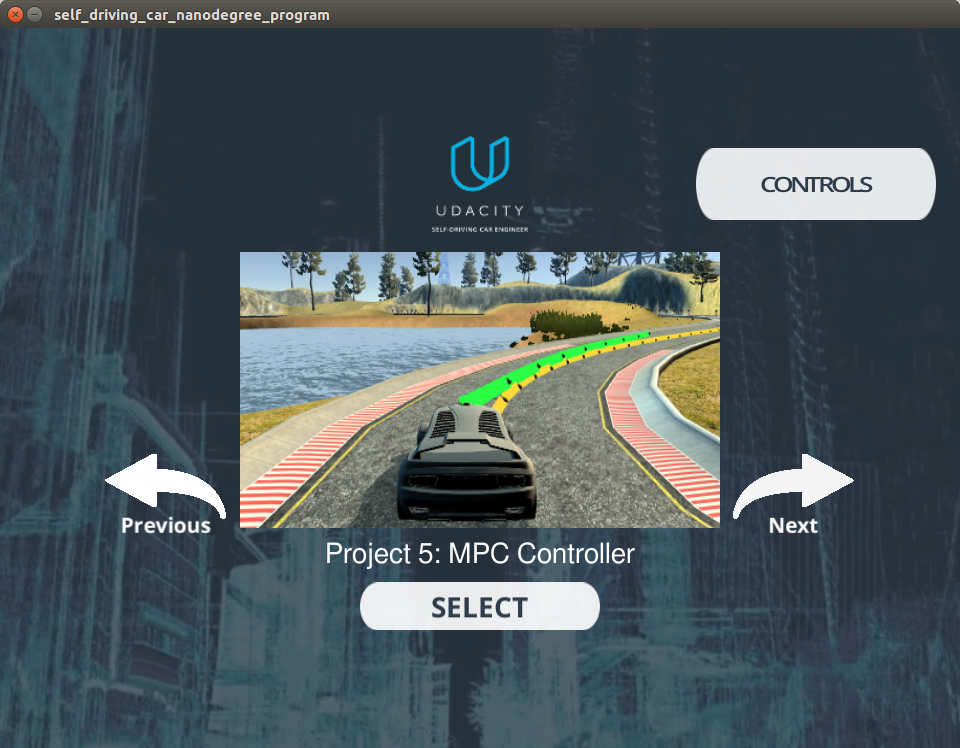

# Model predictive control


 Model predictive control project for combined longitudinal and lateral control of the autonomous vehicles. It uses [udacity vehicle simulator](https://github.com/udacity/self-driving-car-sim/releases). The simulator sends the reference trajectory and the MPC sends the steering angle and the throttle value to the simulator. They are communicated by uWebSockets. The data specification is written in [DATA.md](./DATA.md).


If you want to more information of this project, please visit this [link](https://kyuhwanyeon.github.io/planning/mpcformulation/). I summarized the project more detail to describe more deeply.  


### Kinematic model 

The kinematic model is used for vehicle model.



### Reference path

The reference path was fitted with 3-order polynomials

```c++
auto coeffs = polyfit(xvals, yvals, 3);
```


### Error states

Three error states are used.

		
	

```cte``` is refers the cross track error which is lateral difference with reference path. ```epsi``` means the orientation error like above picture. For velocity keeping, velocity error was used.


### MPC Formulation



This MPC minimize error states, magnitude of inputs and derivative of inputs.


### Latency compensation

MPC can consider the latency of inputs. In real vehicle, there is latency of inputs. It means that steering command will not directly applied to the car because there are many delay terms such communication, and mechanic parts. MPC can compensate it easily by use the future reference path.

 ```          c++
  const double latency = 0.1; // 100ms latency
  px = px + v * cos(psi) * latency;
  py = py + v * sin(psi) * latency;    
 ```


### Prediction horizon

Prediction horizon (**N*dt**) needs to be optimized. I found the values with try and error


## Dependencies

* git lfs

* cmake >= 3.5

 * All OSes: [click here for installation instructions](https://cmake.org/install/)

* make >= 4.1(mac, linux), 3.81(Windows)
  * Linux: make is installed by default on most Linux distros
  * Mac: [install Xcode command line tools to get make](https://developer.apple.com/xcode/features/)
  * Windows: [Click here for installation instructions](http://gnuwin32.sourceforge.net/packages/make.htm)
  
* gcc/g++ >= 5.4
  * Linux: gcc / g++ is installed by default on most Linux distros
  * Mac: same deal as make - [install Xcode command line tools]((https://developer.apple.com/xcode/features/)
  * Windows: recommend using [MinGW](http://www.mingw.org/)
  
* [uWebSockets](https://github.com/uWebSockets/uWebSockets)
  * Run either `install-mac.sh` or `install-ubuntu.sh`.
  * If you install from source, checkout to commit `e94b6e1`, i.e.
    ```
    git clone https://github.com/uWebSockets/uWebSockets
    cd uWebSockets
    git checkout e94b6e1
    ```
    Some function signatures have changed in v0.14.x. See [this PR](https://github.com/udacity/CarND-MPC-Project/pull/3) for more details.

* **Ipopt and CppAD:** Please refer to [this document](https://github.com/udacity/CarND-MPC-Project/blob/master/install_Ipopt_CppAD.md) for installation instructions.

* [Eigen](http://eigen.tuxfamily.org/index.php?title=Main_Page). This is already part of the repo so you shouldn't have to worry about it.

* Simulator. You can download these from the [releases tab](https://github.com/udacity/self-driving-car-sim/releases).

* Not a dependency but read the [DATA.md](./DATA.md) for a description of the data sent back from the simulator.


## Basic Build Instructions

1. Clone this repo.
2. Make a build directory: `mkdir build && cd build`
3. Compile: `cmake .. && make`
4. Run it: `./mpc`.

## Build with Docker-Compose
The docker-compose can run the project into a container
and exposes the port required by the simulator to run.

1. Clone this repo.
2. Build image: `docker-compose build`
3. Run Container: `docker-compose up`
4. On code changes repeat steps 2 and 3.

- - -
### Running the project
On terminal
```
mkdir build && cd build
cmake .. && make
./mpc
```
Open the simulator
```
1. Open term2_sim_linux/term2_sim.x86_64
2. Select graphic quality
3. Select Project 5: MPC Controller
```



